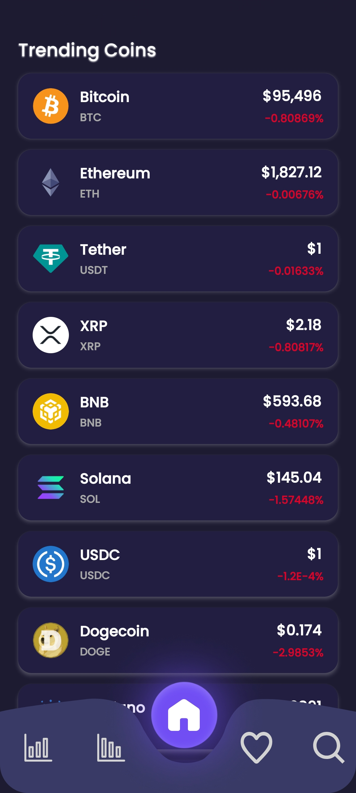
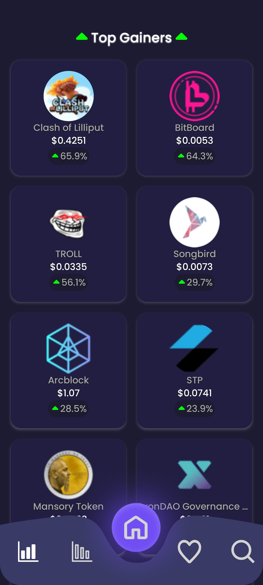
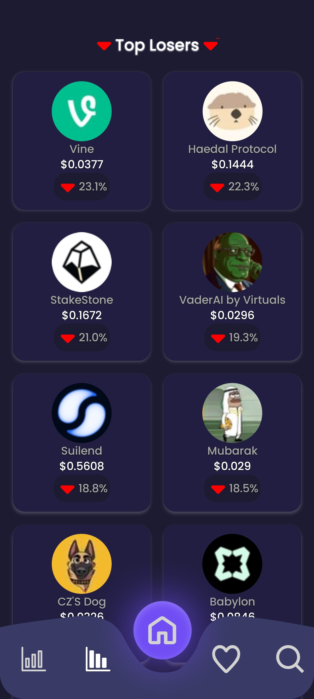
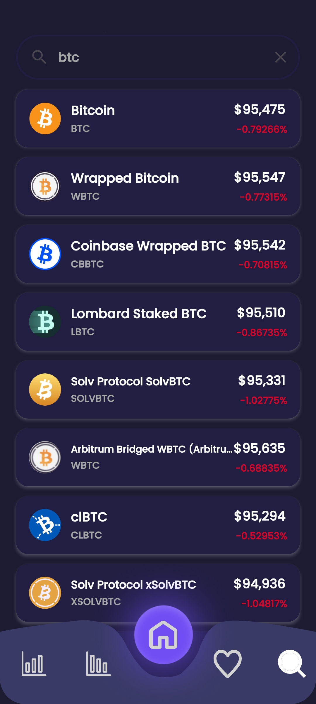
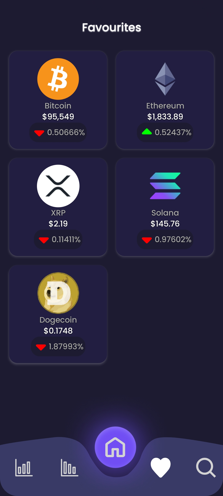
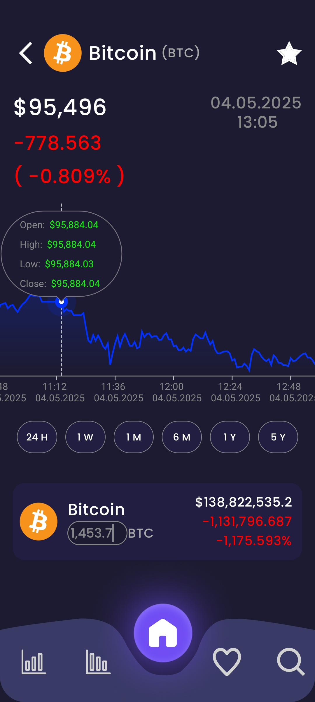
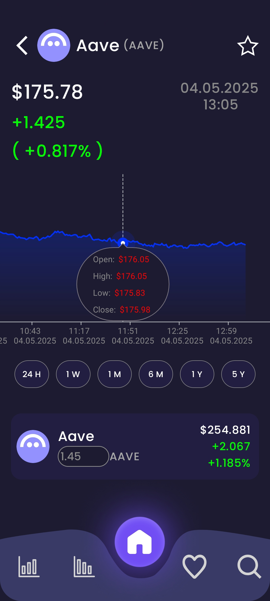
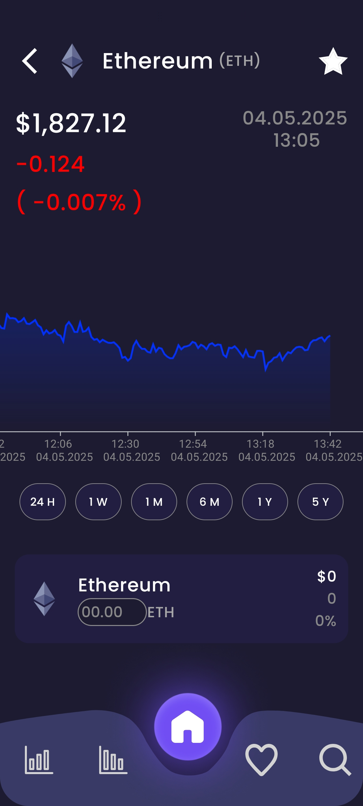

# Finance (Cryptocurrency Tracker Android App)

A modern Android app for tracking cryptocurrency markets built with Jetpack Compose and Material 3.
It fetches live market data, top gainers/losers (via web scraping), and historical price charts, lets
you search coins, and save favourites locally with Room. Dependency injection is handled by Hilt and
charts are rendered with Vico.

## Overview

| **Aspect**               | **Details**               |
|--------------------------|---------------------------|
| **Package**              | `com.receparslan.finance` |
| **Min SDK**              | 26 (Android 8.0+)         |
| **Target / Compile SDK** | 36                        |
| **Kotlin**               | 2.3.10                    |
| **AGP**                  | 9.1.0                     |
| **Compose BOM**          | 2026.02.01                |
| **JDK Toolchain**        | 21                        |

## Features

- Live cryptocurrency market list with price and 24h change (paginated, 250 per page)
- Infinite scroll with automatic page loading
- Pull-to-refresh on all screens
- Top Gainers and Top Losers grids (scraped from CoinGecko with JSoup)
- Favourites persisted locally with Room database
- Search coins by name or symbol with real-time results
- Detail screen with interactive Vico line chart and coin metadata
- Historical chart with 6 time periods: 24H, 1W, 1M, 6M, 1Y, 5Y
- Save/remove coins from favourites on the detail screen
- Bottom navigation with 5 tabs (Home, Gainers, Losers, Favourites, Search)
- Material 3 light/dark theme with custom Poppins typography
- Error dialogs with retry option and comprehensive loading/empty states

## Screenshots

| Home Page                                                            | Gainers                                                              | Losers                                                             |
|----------------------------------------------------------------------|----------------------------------------------------------------------|--------------------------------------------------------------------|
|  |  |  |

| Search                                                              | Favourites                                                                  |
|---------------------------------------------------------------------|-----------------------------------------------------------------------------|
|  |  |

| Detail                                                                | Detail                                                                  | Detail                                                                  |
|-----------------------------------------------------------------------|-------------------------------------------------------------------------|-------------------------------------------------------------------------|
|  |  |  |

## Tech Stack

| Category | Library | Version |
|---|---|---|
| UI | Jetpack Compose + Material 3 | BOM 2026.02.01 |
| Navigation | Navigation Compose | 2.9.7 |
| Icons | Material Icons Extended | 1.7.8 |
| DI | Hilt | 2.59.2 |
| DI (Compose) | Hilt Navigation Compose | 1.3.0 |
| Networking | Retrofit | 3.0.0 |
| HTTP Client | OkHttp + Logging Interceptor | 5.3.2 |
| JSON | Gson (Retrofit Converter) | 3.0.0 |
| Web Scraping | JSoup | 1.22.1 |
| Database | Room (Runtime + KTX + Compiler) | 2.8.4 |
| Images | Coil Compose | 2.7.0 |
| Charts | Vico Compose | 3.0.2 |
| Lifecycle | Lifecycle Runtime KTX | 2.10.0 |
| Activity | Activity Compose | 1.12.4 |
| Core | AndroidX Core KTX | 1.17.0 |

## Architecture (MVVM)

This project follows a clean **Model–View–ViewModel** architecture with a **Repository** pattern
and **Hilt** dependency injection:

```
UI (Compose Screens)
    ↓ observes StateFlow
ViewModel (business logic + UI state)
    ↓ calls
Repository (interface → implementation)
    ↓ delegates to
Service Layer (Retrofit APIs + JSoup Scraper) / Room Database
```

### Layers

- **Model**: Data classes (`Cryptocurrency`, `CryptocurrencyList`, `KlineData`) and persistence
  layer (Room entity + `CryptocurrencyDao` + `CryptocurrencyDatabase`).
- **View**: Jetpack Compose screens in `ui/screens/` plus `MainActivity` which hosts the `NavHost`
  and bottom navigation bar. Composables render immutable state and emit user intents.
- **ViewModel**: One per screen (`HomeViewModel`, `DetailViewModel`, `SearchViewModel`,
  `FavouritesViewModel`, `GainerAndLoserViewModel`). Each exposes a `StateFlow` of a dedicated UI
  state data class and encapsulates business logic.
- **Repository**: `CryptoRepository` interface with `CryptoRepositoryImpl` implementation. Abstracts
  all data sources (CoinGecko API, Binance API, CoinGecko scraper, Room DB) behind a single
  contract.
- **Service / Data Source**: Separate Retrofit interfaces (`CoinGeckoApiService`, `BinanceApiService`)
  and a `CoinGeckoScraper` (JSoup). Injected via Hilt `@Named` qualifiers for distinct base URLs.
- **DI**: `AppModule` provides Retrofit instances, OkHttp client, Room database, and DAO.
  `RepositoryModule` binds the repository interface to its implementation.

### State Management

Each screen has a dedicated UI state data class (e.g., `HomeUIState`, `DetailUIState`,
`SearchUIState`, `FavouriteUIState`, `GainerAndLoserUIState`) defined in `util/States.kt`. State is
exposed via `StateFlow` and collected by Composables.

### Error Handling & Retry

- `Resource<T>` sealed class (`Success` / `Error`) wraps all network responses.
- Automatic retry logic with configurable max retries (15) and delay (2 seconds) in the repository.
- User-facing `ErrorDialog` composable surfaces errors with a retry action.

## API Details

Two public APIs and a web scraper are used:

### 1. CoinGecko API (Base: `https://api.coingecko.com/api/v3/`)

- `GET coins/markets?vs_currency=usd&per_page=250&page={n}` — paginated market data (id, symbol,
  name, image, current price, 24h change, last updated).
- `GET search?query={text}` — search coins by name; response wrapped in `CryptocurrencyList`.
- `GET coins/markets?ids={id1,id2,...}` — fetch specific coins by IDs (used for favourites).
- Rate Limits: Public free tier ~30–50 calls/min per IP. Excess requests may yield 429 responses;
  the repository handles retry with backoff.

### 2. Binance API (Base: `https://api.binance.com/api/v3/`)

- `GET klines?symbol={SYMBOL}USDT&startTime={ms}&endTime={ms}&interval={code}&limit=1000` —
  historical OHLCV data for charts. Raw array responses are deserialized via a custom
  `KlineDataDeserializer` into `KlineData` objects.
- Supported intervals: `1m`, `5m`, `15m`, `1h`, `4h`, `1d`, etc.
- Weight-based rate limits; current single-user usage is well within limits.

### 3. CoinGecko Web Scraping (JSoup)

- `CoinGeckoScraper` scrapes `https://www.coingecko.com/en/crypto-gainers-losers` for top
  gainers and losers data (name, symbol, image, price, 24h change percentage).

### Security & Privacy

- No secrets or user PII stored; favourites persist locally only.
- All requests are HTTPS.
- Network permissions: `INTERNET` and `ACCESS_NETWORK_STATE` declared in `AndroidManifest.xml`.

## Requirements

- Android Studio Ladybug or newer
- Android Gradle Plugin 9.1+
- JDK 21 (project is configured for Java/Kotlin 21 toolchain)
- Internet connection (uses public CoinGecko and Binance endpoints; no API keys required)

## Getting Started

### Open in Android Studio

1. Clone the repo
2. File → Open → select the project root
3. Let Gradle sync finish
4. Run the `app` configuration on a device/emulator (Android 8.0+, API 26+)

### Build from terminal (Windows PowerShell)

```powershell
# From project root
./gradlew.bat clean
./gradlew.bat :app:assembleDebug
```

APK output: `app/build/outputs/apk/debug/`.

## Project Structure

```
com.receparslan.finance/
├── MainActivity.kt                     # Compose scaffold + bottom nav + NavHost
├── database/
│   ├── CryptocurrencyDatabase.kt       # Room database definition
│   └── CryptocurrencyDao.kt            # DAO for favourites CRUD
├── hilt/
│   ├── AppModule.kt                    # DI: Retrofit, OkHttp, Room providers
│   ├── RepositoryModule.kt             # DI: Repository binding
│   └── FinanceApplication.kt           # @HiltAndroidApp entry point
├── model/
│   └── Cryptocurrency.kt               # Data models (Cryptocurrency, KlineData)
├── repository/
│   ├── CryptoRepository.kt             # Repository interface
│   └── CryptoRepositoryImpl.kt         # Implementation with retry logic
├── service/
│   ├── CoinGeckoApiService.kt          # Retrofit interface (markets, search)
│   ├── BinanceApiService.kt            # Retrofit interface (klines)
│   └── CoinGeckoScraper.kt             # JSoup web scraper (gainers/losers)
├── ui/
│   ├── NavigationItem.kt               # Navigation items + sealed Screen class
│   ├── screens/
│   │   ├── HomeScreen.kt               # Paginated market list
│   │   ├── GainerScreen.kt             # Top gainers grid
│   │   ├── LoserScreen.kt              # Top losers grid
│   │   ├── SearchScreen.kt             # Coin search
│   │   ├── FavouritesScreen.kt         # Saved coins grid
│   │   └── DetailScreen.kt             # Coin detail with chart
│   ├── components/
│   │   ├── CryptocurrencyRow.kt        # List row item
│   │   ├── GridItem.kt                 # Grid cell item
│   │   ├── CenterHeaderText.kt         # Centered header
│   │   ├── ScreenHolder.kt             # Loading/empty state wrapper
│   │   └── ErrorDialog.kt              # Error dialog with retry
│   ├── charts/
│   │   └── LineChart.kt                # Vico line chart wrapper
│   ├── markers/
│   │   └── Marker.kt                   # Custom chart markers
│   └── theme/
│       ├── Theme.kt                    # Material 3 light/dark theme
│       ├── Color.kt                    # Color palette
│       └── Type.kt                     # Poppins typography
├── util/
│   ├── Constants.kt                    # API URLs, retry config, time constants
│   ├── Extension.kt                    # LazyListState extensions
│   ├── Resource.kt                     # Sealed class (Success/Error)
│   ├── States.kt                       # UI state data classes
│   └── KlineDataDeserializer.kt        # Custom Gson deserializer for klines
└── viewmodel/
    ├── HomeViewModel.kt                # Pagination, market data
    ├── DetailViewModel.kt              # Details, chart data, favourites
    ├── SearchViewModel.kt              # Search query handling
    ├── FavouritesViewModel.kt          # Saved coins observation
    └── GainerAndLoserViewModel.kt      # Gainers/losers fetching
```

## Notes

- Public market data is subject to rate limits and availability.
- This project is for educational/demo purposes only; not financial advice.

## License

This project is licensed under the MIT License — see [`LICENSE`](LICENSE) for details.
