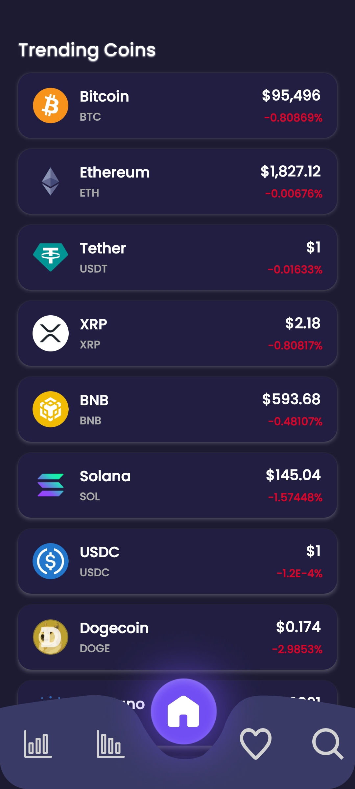
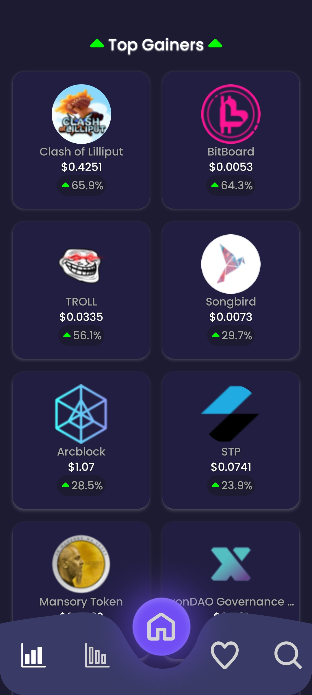
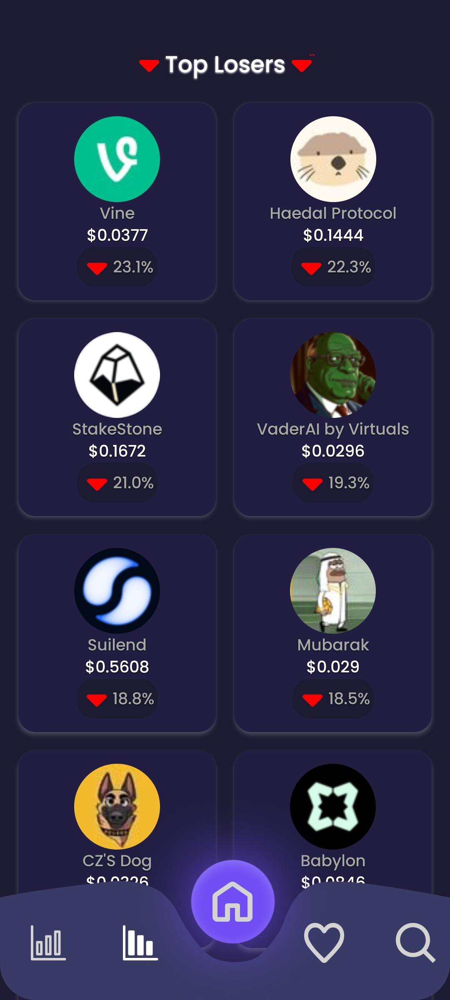
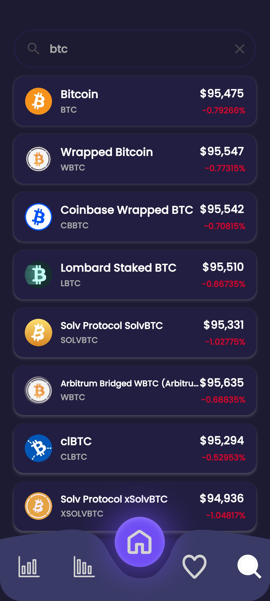
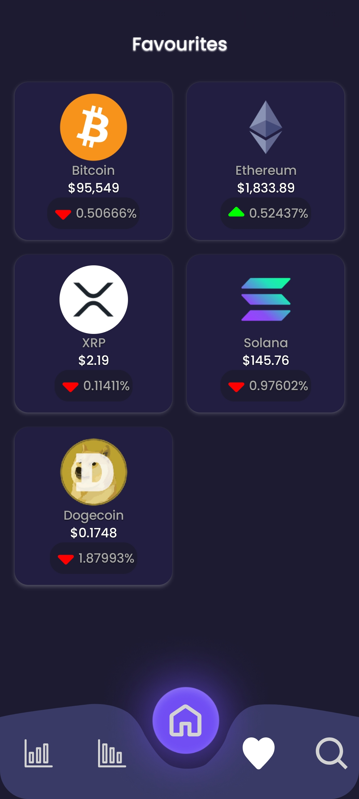
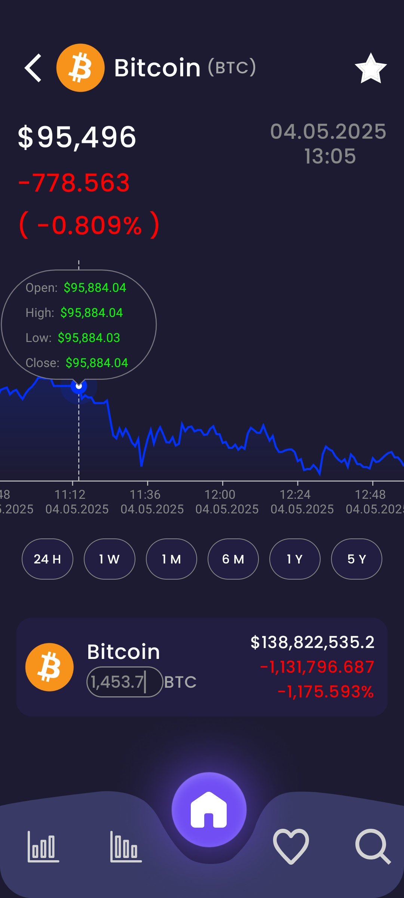
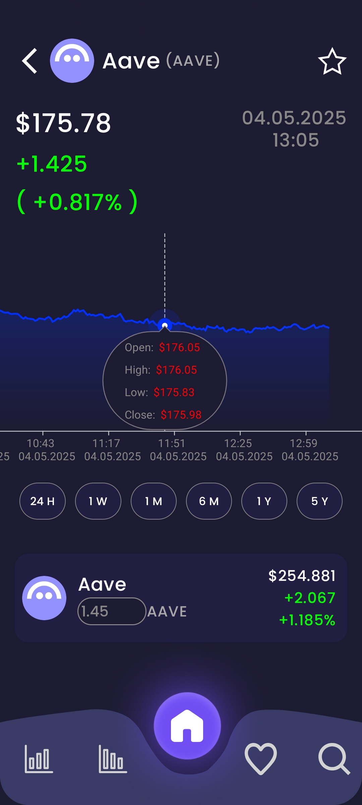
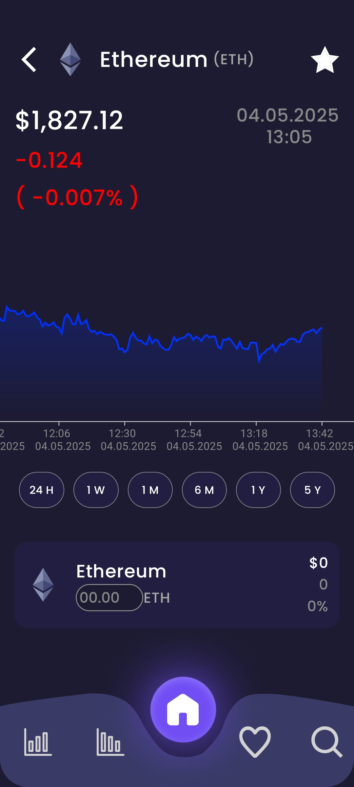
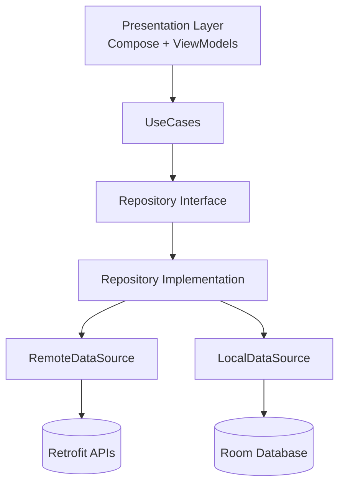

# Finance (Cryptocurrency Tracker Android App)


A modern Android app for tracking cryptocurrency markets built with Jetpack Compose and Material 3.
It fetches live market data, top gainers/losers (via web scraping), and historical price charts, lets
you search coins, and save favourites locally with Room. Dependency injection is handled by Hilt and
charts are rendered with Vico.

## Table of Contents

- [Overview](#overview)
- [Features](#features)
- [Screenshots](#screenshots)
- [Tech Stack](#tech-stack)
- [Getting Started](#getting-started)
- [Architecture](#architecture)
- [Project Structure](#project-structure)
- [Learning Goals](#learning-goals)
- [Known Limitations](#known-limitations)
- [Future Improvements](#future-improvements)
- [Contact](#contact)
- [Disclaimer](#disclaimer)
- [Acknowledgements](#acknowledgements)
- [License](#license)

## Overview

| **Aspect**               | **Details**               |
|--------------------------|---------------------------|
| **Package**              | `com.receparslan.finance` |
| **Min SDK**              | 26 (Android 8.0+)         |
| **Target / Compile SDK** | 36                        |
| **Kotlin**               | 2.3.10                    |
| **AGP**                  | 9.1.0                     |
| **Compose BOM**          | 2026.02.01                |
| **JDK Toolchain**        | 21                        |

## Features

- Live cryptocurrency market list with price and 24h change (paginated, 250 per page)
- Infinite scroll with automatic page loading
- Pull-to-refresh on all screens
- Top Gainers and Top Losers grids (scraped from CoinGecko with JSoup)
- Favourites persisted locally with Room database
- Search coins by name or symbol with real-time results
- Detail screen with interactive Vico line chart and coin metadata
- Historical chart with 6 time periods: 24H, 1W, 1M, 6M, 1Y, 5Y
- Save/remove coins from favourites on the detail screen
- Bottom navigation with 5 tabs (Home, Gainers, Losers, Favourites, Search)
- Material 3 light/dark theme with custom Poppins typography
- Error dialogs with retry option and comprehensive loading/empty states

## Screenshots

| Home Page                                                           | Gainers                                                             | Losers                                                            |
|---------------------------------------------------------------------|---------------------------------------------------------------------|-------------------------------------------------------------------|
|  |  |  |

| Search                                                             | Favourites                                                                 |
|--------------------------------------------------------------------|----------------------------------------------------------------------------|
|  |  |

| Detail                                                               | Detail                                                                 | Detail                                                                 |
|----------------------------------------------------------------------|------------------------------------------------------------------------|------------------------------------------------------------------------|
|  |  |  |

## Tech Stack

| Category     | Library                         | Version        |
|--------------|---------------------------------|----------------|
| Architecture | Clean Architecture + MVVM       | -              |
| Concurrency  | Kotlin Coroutines + Flow        | -              |
| Reactive UI  | StateFlow                       | -              |
| UI           | Jetpack Compose + Material 3    | BOM 2026.02.01 |
| Navigation   | Navigation Compose              | 2.9.7          |
| Icons        | Material Icons Extended         | 1.7.8          |
| DI           | Hilt                            | 2.59.2         |
| DI (Compose) | Hilt Navigation Compose         | 1.3.0          |
| Networking   | Retrofit                        | 3.0.0          |
| HTTP Client  | OkHttp + Logging Interceptor    | 5.3.2          |
| JSON         | Gson (Retrofit Converter)       | 3.0.0          |
| Web Scraping | JSoup                           | 1.22.1         |
| Database     | Room (Runtime + KTX + Compiler) | 2.8.4          |
| Images       | Coil Compose                    | 2.7.0          |
| Charts       | Vico Compose                    | 3.0.2          |
| Lifecycle    | Lifecycle Runtime KTX           | 2.10.0         |
| Activity     | Activity Compose                | 1.12.4         |
| Core         | AndroidX Core KTX               | 1.17.0         |

## Getting Started

### Prerequisites

- Android Studio (latest stable release recommended)
- JDK 21
- Android SDK with API level 36 installed
- A device or emulator running Android 8.0 (API 26) or higher

### Installation

1. Clone the repository:
   ```bash
   git clone https://github.com/receparslan42/Finance.git
   cd Finance
   ```
2. Open the project in Android Studio.
3. Let Gradle sync and download the required dependencies.
4. Run the app on an emulator or a physical device via **Run ▶**.

## Architecture

This project follows **Clean Architecture** principles combined with **MVVM**, the **Repository Pattern**, and a **UseCase** layer. The Domain layer is kept as pure Kotlin, fully independent of Retrofit, Room, and UI frameworks, which keeps business logic testable, maintainable, and easy to reason about as the app grows.

### Architecture Flow


```mermaid
flowchart TD

A[Presentation Layer<br/>Compose + ViewModels]

B[UseCases]

C[Repository Interface]

D[Repository Implementation]

E[RemoteDataSource]

F[LocalDataSource]

G[(Retrofit APIs)]

H[(Room Database)]

A --> B
B --> C
C --> D
D --> E
D --> F
E --> G
F --> H
```

### Layers

- **Presentation Layer** — Jetpack Compose UI and ViewModels. ViewModels talk **only** to UseCases and observe `StateFlow` for UI updates.
- **Domain Layer** — pure Kotlin, no Android framework dependencies:
  - **Models** — domain-specific data structures.
  - **UseCases** — fine-grained business logic classes.
  - **Repository Interfaces** — contracts for data operations.
- **Data Layer** — responsible for data procurement:
  - **Repository Implementation** — coordinates `RemoteDataSource` and `LocalDataSource` as the single source of truth.
  - **DataSources** — encapsulate Retrofit (remote) and Room (local) logic.
  - **DTOs / Entities** — network- and database-specific models, never exposed outside the Data layer.
  - **Mappers** — extension functions that convert DTOs/Entities into Domain models.

**Dependency rule:** Presentation depends only on UseCases, and UseCases depend only on Repository interfaces. Combined with explicit DTO/Entity/Domain separation, this is what keeps the codebase's layers loosely coupled and independently testable.

## Project Structure

The project is organized into `core` and `feature` packages to support scalability:

```
com.receparslan.finance/
├── core/
│   ├── common/                 # Resource wrappers, Constants, Extensions, Utilities
│   ├── data/
│   │   ├── local/              # Room Database, DAO, Entities, LocalDataSource
│   │   ├── remote/             # Retrofit APIs, DTOs, RemoteDataSource
│   │   ├── mapper/             # DTO ↔ Domain ↔ Entity mappers
│   │   └── repository/         # Repository implementations
│   ├── domain/
│   │   ├── model/              # Shared domain models
│   │   └── repository/         # Repository interfaces
│   ├── navigation/             # Navigation graph and destinations
│   └── ui/                     # Shared UI components, Theme, Charts
│
└── feature/
    ├── home/
    │   ├── domain/             # Home-specific UseCases
    │   └── presentation/       # Home screen, ViewModel, UI state
    │
    ├── detail/
    │   ├── data/               # Detail DTOs and mappers
    │   ├── domain/             # Detail models and UseCases
    │   └── presentation/       # Detail screen, ViewModel, chart UI
    │
    ├── search/
    │   ├── data/               # Search DTOs and mappers
    │   ├── domain/             # Search UseCases
    │   └── presentation/       # Search screen and ViewModel
    │
    ├── favourites/
    │   ├── domain/             # Favourite-related UseCases
    │   └── presentation/       # Favourites screen and ViewModel
    │
    └── gainloss/
        ├── data/               # Gainers/Losers DTOs and mappers
        ├── domain/             # Gainers/Losers models and UseCases
        └── presentation/       # Gainers/Losers screens and ViewModels
```

Each feature is further divided into `data`, `domain`, and `presentation` layers where appropriate (e.g., feature-specific UseCases).

## Learning Goals

This project was primarily built to deepen my understanding of modern Android application architecture rather than to create a production-ready finance application.

During development, I focused on implementing and understanding:

- Clean Architecture
- MVVM
- Repository Pattern
- UseCases
- DTO / Entity / Domain model separation
- Mapper Layer
- RemoteDataSource
- LocalDataSource
- Dependency Injection with Hilt
- Kotlin Coroutines
- Flow & StateFlow
- Jetpack Compose
- Material 3 Design

## Known Limitations

- **Top Gainers / Top Losers rely on web scraping.** These screens parse CoinGecko's HTML with JSoup instead of calling a dedicated API endpoint, so a layout change on CoinGecko's side can break this feature until the scraping logic is updated.
- **Public market data is subject to rate limits and availability.** Frequent or heavy use may hit provider rate limits, resulting in failed requests or stale data.
- No offline-first support yet — most screens require a network connection on first load.

## Future Improvements

Some improvements that could be implemented in future versions include:

- Offline-first synchronization strategy
- Paging 3 integration
- Unit and UI testing
- CI/CD pipeline
- Better caching strategy
- A more resilient data source for Top Gainers/Losers (a stable API instead of scraping, if one becomes available)

## Contact

**Recep Arslan**

- GitHub: [@receparslan42](https://github.com/receparslan42)
- LinkedIn: https://www.linkedin.com/in/recep-arslan-2a3037246
- Email: receparslan965&#64;gmail&#46;com

## Disclaimer

This application is intended for educational purposes and portfolio demonstration. It should not be considered financial advice or used for investment decisions.

## Acknowledgements

This project uses public cryptocurrency data provided by:

- CoinGecko API
- Binance API

Charts are built using the Vico chart library.

## License

This project is licensed under the MIT License — see [`LICENSE`](LICENSE) for details.